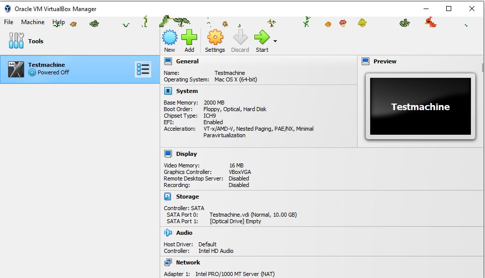

## Lab 07

- Name:
- Email

## Part 1 Answers

1. Steps to configure virtual hardware: Dropdown menus allowed me to set up the name, type, and version of the system. Enabling "expert mode" allowed me to change the disk size. I could edit the ram, but was unable to get the format to "GB", so i set it to 2000 MB.
2. 
3. Steps to download an ISO: Googled "ubunntu desktop ISO" and found the ISo download in the official ubuntu page.
4. Steps to use ISO on VM:Go to setting, sorage, click the disk icon, then choose "new disk" and seelct your ISO file.
5. Steps to install your distribution: When I booted after putting in the disk, an install wizard popped up, which I followed.
6. Steps to boot to disk after install: Remove virtual disk from slot.
7. Steps to use full screen mode: Select "full screen mode" under "view"
8. 

## Part 2 Answers

1. Steps to change desktop background: Right clikc background, click "change background"
2. Steps to open a web browser: click on the web browser icon.
3. Steps to install VSCode.: Use the web browser to naviaget to the VScode website, and download it the way you would normally.
4. Steps to connect to your AWS instance from your VM.: I opened the "terminal" aplication, which opened a linux window. After that, it was a simple matter of finding my key again (I did not have it saved on this computer), it was a simple matter of sshing into AWS the exact same way I would on my actual computer.
